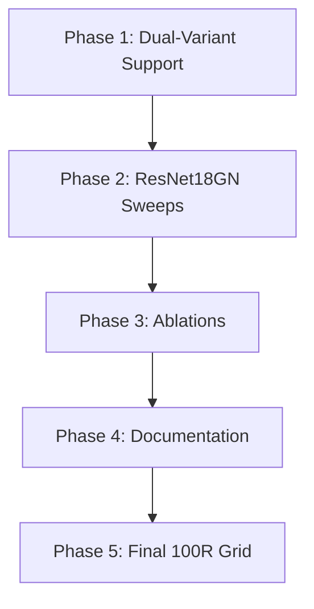

# Audit Remediation Plan

Address all findings from the [audit](file:///c:/Users/Quirora/Documents/GitHub/fedmaq-experiments/docs/audits/fedmaq-audit.md) and [HANDOFF](file:///c:/Users/Quirora/Documents/GitHub/fedmaq-experiments/HANDOFF.md).

---

## Decisions

- **ResNet18GN switch**: Approved. Keep SimpleCNN results as the `fedmaq_lite` variant (documenting that even on smaller models, FedMAQ can outperform larger baselines).
- **EMA decay default**: Fixed to `0.7` in `fedmaq.yaml`.
- **Adaptive β scheduling**: Future work only.
- **Temperature ablation**: Run $T \in \{1.0, 2.0\}$ × $\alpha \in \{0.1, 1.0\}$ on `fedmaq_lite` first to conclude its sweeps.
- **Fixed compute speed**: Keep as-is. Variable compute is future work.
- **Formulation study re-run**: Re-run on ResNet18GN if time permits.

---

## Phase 1 — Dual-Variant Architecture Support

Support both ResNet18GN (`fedmaq`) and SimpleCNN (`fedmaq_lite`) as two distinct algorithm configs.

### [MODIFY] [models.py](file:///c:/Users/Quirora/Documents/GitHub/fedmaq-experiments/src/fedmaq/core/models.py)

```diff
 def get_client_model(alg_name: str, dataset_name: str, num_classes: int) -> nn.Module:
-    if alg_name in {"fedkd", "fedmaq"}:
+    if alg_name in {"fedkd", "fedmaq_lite"}:
         return get_kd_student_model(dataset_name, num_classes)
     return get_model(dataset_name, num_classes)
```

### [NEW] [fedmaq_lite.yaml](file:///c:/Users/Quirora/Documents/GitHub/fedmaq-experiments/conf/algorithm/fedmaq_lite.yaml)

Copy of `fedmaq.yaml` with `name: fedmaq_lite`.

### [MODIFY] [fedmaq.py](file:///c:/Users/Quirora/Documents/GitHub/fedmaq-experiments/src/fedmaq/core/strategy_hooks/fedmaq.py)

1. **Import**: Replace `get_kd_student_model` with `get_model`. Also import `get_kd_student_model` since the hook needs both (for `fedmaq_lite`).

```diff
 from fedmaq.core.models import (
     DEVICE,
+    get_model,
     get_kd_student_model,
     set_model_parameters,
 )
```

2. **Dynamic model factory**: The hook must pick the correct factory based on algorithm name, since both `fedmaq` and `fedmaq_lite` share `FedMAQHook`:

```python
alg_name = self._config.get("algorithm", {}).get("name", "fedmaq")
model_fn = get_kd_student_model if alg_name == "fedmaq_lite" else get_model
```

Apply this pattern to:

- Grad-norm probe instantiation (~L168)
- `distill_ensemble_into_global` model_factory parameter (~L304)

### [MODIFY] Hook dispatchers

Ensure `"fedmaq_lite"` maps to `FedMAQHook`, `FedMAQFit`, and `FedPAQCompressionHook` in:

- `strategy_hooks/__init__.py`
- `client_hooks/__init__.py`
- Compressor hook dispatch

### Verification

- [ ] Tests pass
- [ ] 5-round smoke: `algorithm=fedmaq` uses ResNet18GN (larger `bytes_uploaded`)
- [ ] 5-round smoke: `algorithm=fedmaq_lite` uses SimpleCNN (matches prior results)
- [ ] Grad-norm and KD run without shape mismatches for both variants

---

## Phase 2 — Re-Run Core Sweeps on ResNet18GN

### 2.1 EMA Decay Sweep

- 50R, $\alpha \in \{0.1, 1.0\}$, $\beta \in \{0.1, ..., 0.9\}$
- Store: `docs/experiments/ema-decay-sweep-resnet18/`

### 2.2 Formulation Study (if time permits)

- 40R, 5 formulations × 2 α = 10 runs
- Store: `docs/experiments/formulation-study-resnet18/`

### 2.3 Baseline Re-Comparison

- 40R, FedMAQ (ResNet18GN, best β) vs all baselines
- Store: `docs/experiments/baseline-comparison-resnet18/`

---

## Phase 3 — Temperature & Soft-Voting Ablations

### 3.1 Temperature Ablation (4 runs)

- $T \in \{1.0, 2.0\}$ × $\alpha \in \{0.1, 1.0\}$, best β from Phase 2
- Store: `docs/experiments/temperature-ablation/`

### 3.2 Soft-Voting on ResNet18GN

- Re-run top-3 winning $(\gamma_e, \gamma_p)$ from the current SimpleCNN sweep
- Store: `docs/experiments/soft-voting-resnet18/`

---

## Phase 4 — Documentation

- Add EMA–FedAvg ordering defense comment at `fedmaq.py:L316`
- Add future-work notes for adaptive β and variable compute
- Update HANDOFF.md with new results and resolved items

---

## Phase 5 — Final 100-Round Grid

### Primary (ResNet18GN)

- 100R, $\alpha \in \{0.1, 0.3, 0.5, 1.0\}$, seeds $\{0, 42, 123\}$, ~8 algorithms
- **~96 runs**

### Secondary (SimpleCNN — `fedmaq_lite`)

- Same α/seed sweep, FedMAQ-Lite only
- **~12 runs**

---

## Dependency Graph


